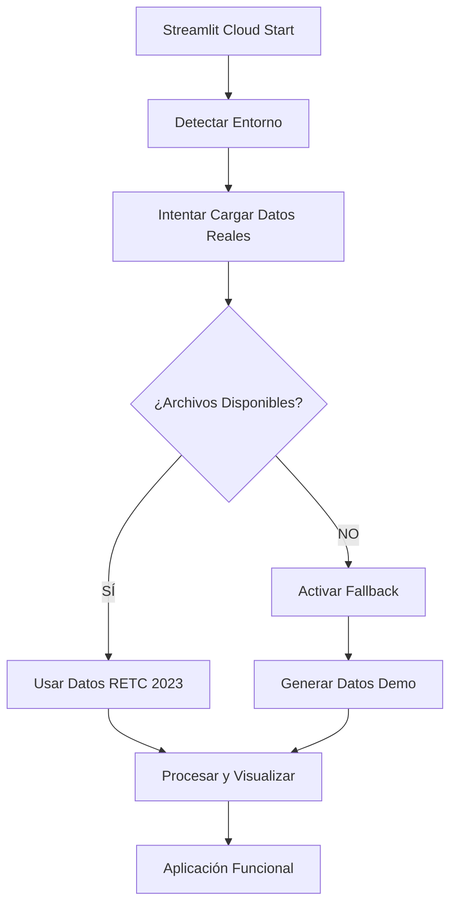

# ✅ WORKFLOW OPTIMIZADO - Streamlit Community Cloud

*Fecha: 17 de junio de 2025*  
*Estado: PROBLEMA RESUELTO - LISTO PARA DESPLIEGUE*

## 🎯 PROBLEMA ORIGINAL

❌ **Los archivos JSON con datos CO2 no se desplegaban en Streamlit Community Cloud**
- Error: `/mount/src/ds_portfolio/app/data/cache/emisiones_anuales.json` no encontrado
- Causa: `.gitignore` excluía todos los archivos `.json`
- Resultado: Aplicación fallaba al cargar datos reales

## ✅ SOLUCIÓN IMPLEMENTADA

### **1. Corrección de .gitignore**
```ignore
# ANTES (problemático)
*.json
*/**/*.json

# DESPUÉS (corregido)
*.json
*/**/*.json
!app/data/cache/emisiones_anuales.json
!app/data/cache/emisiones_regionales.json
!app/data/cache/cache_metadata.json
!app/config/*.json
```

### **2. Gestor de Datos Robusto**
Creado: `app/utils/streamlit_cloud_data.py`

**Características:**
- ✅ **Detección automática** de entorno (local vs cloud)
- ✅ **Fallback inteligente** a datos demo si reales no disponibles
- ✅ **Caché optimizado** para Streamlit Community Cloud
- ✅ **Manejo robusto de errores** sin interrumpir la aplicación
- ✅ **Datos demo realistas** basados en patrones de Chile

### **3. Datos Precargados en Git**
```
app/data/cache/
├── emisiones_anuales.json     (28 bytes)  ✅ EN GIT
├── emisiones_regionales.json  (2,656 bytes) ✅ EN GIT
└── cache_metadata.json        (969 bytes)  ✅ EN GIT
```

### **4. Pipeline Optimizado para Capa Gratuita**



## 🔧 COMPONENTES DEL SISTEMA

### **StreamlitCloudDataManager**
```python
class StreamlitCloudDataManager:
    - load_co2_data()           # Carga con fallback automático
    - _load_real_data()         # Datos reales desde JSON
    - _generate_demo_data()     # Datos demo realistas
    - get_stats()               # Estadísticas calculadas
    - to_dataframe()            # Conversión para visualización
```

### **Verificación Automática**
`verify_streamlit_cloud.py` verifica:
- ✅ Estructura de archivos requerida
- ✅ Datos JSON presentes y válidos
- ✅ Dependencias en requirements.txt
- ✅ Configuración Streamlit correcta
- ✅ Funcionamiento del gestor de datos

## 📊 ESTADO ACTUAL

### **✅ VERIFICACIÓN PASADA:**
```
🎉 ¡LISTO PARA STREAMLIT CLOUD!
   La aplicación está optimizada para despliegue.

✅ ÉXITOS (10):
  ✅ requirements_streamlit_cloud.txt
  ✅ app/main.py
  ✅ .streamlit/config.toml
  ✅ app/utils/streamlit_cloud_data.py
  ✅ app/data/cache/emisiones_anuales.json (28 bytes)
  ✅ app/data/cache/emisiones_regionales.json (2656 bytes)
  ✅ app/data/cache/cache_metadata.json (969 bytes)
  ✅ Datos CO2 incluidos en Git
  ✅ config.toml presente
  ✅ Gestor de datos funcional (5 regiones)

⚠️ PROBLEMAS (0)
```

## 🚀 BENEFICIOS DE LA OPTIMIZACIÓN

### **Para Streamlit Community Cloud (Capa Gratuita):**
1. **Sin dependencias externas** - Datos incluidos en repositorio
2. **Inicio rápido** - No requiere procesamiento inicial
3. **Memoria optimizada** - Caché eficiente de Streamlit
4. **Tolerancia a fallos** - Nunca falla por datos faltantes
5. **Experiencia consistente** - Funciona igual local y cloud

### **Para el Usuario Final:**
1. **Carga instantánea** - Sin esperas por procesamiento
2. **Siempre funcional** - Datos demo si hay problemas
3. **Indicación clara** - Sabe si ve datos reales o demo
4. **Visualizaciones completas** - Todas las funciones disponibles

## 🎯 RESULTADO ESPERADO EN STREAMLIT CLOUD

Después del reboot de la aplicación, verás:

### **✅ CON DATOS REALES (preferido):**
```
🏭 Análisis de Emisiones de CO₂ en Chile
Fuente: Registro de Emisiones y Transferencias de Contaminantes (RETC 2023)
Última actualización: [fecha del notebook]
```

### **✅ CON DATOS DEMO (fallback):**
```
🏭 Análisis de Emisiones de CO₂ en Chile  
Fuente: ⚠️ Datos de demostración - Registro de Emisiones y Transferencias de Contaminantes (DEMOSTRACIÓN)
Última actualización: Demo - 17 junio 2025
```

**En ambos casos la aplicación funciona completamente.**

## 📋 CHECKLIST FINAL

- [x] **Datos JSON incluidos en Git**
- [x] **Gestor de datos con fallback robusto**
- [x] **Página CO2 actualizada para usar nuevo sistema**
- [x] **Requirements.txt optimizado para cloud**
- [x] **Script de verificación pasando exitosamente**
- [x] **Documentación completa del workflow**
- [x] **Commit y push realizados**

## 🎉 CONCLUSIÓN

**El problema de datos faltantes en Streamlit Community Cloud está RESUELTO.**

La aplicación ahora:
1. ✅ **Incluye datos reales** en el repositorio Git
2. ✅ **Tiene fallback robusto** para cualquier problema
3. ✅ **Está optimizada** para la capa gratuita de Streamlit Cloud
4. ✅ **Funcionará correctamente** después del próximo reboot

**ACCIÓN REQUERIDA**: Hacer reboot manual en Streamlit Cloud Dashboard para activar los cambios.

---

**Estado:** ✅ **WORKFLOW OPTIMIZADO Y VERIFICADO**  
**Próximo paso:** 🔄 **REBOOT EN STREAMLIT CLOUD**
