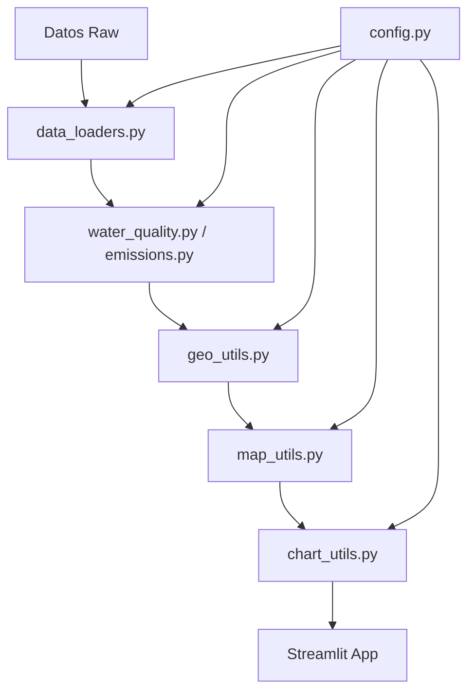

# Módulos del Sistema - Data Science Portfolio

Esta carpeta contiene la arquitectura modular del sistema de visualización de datos ambientales. La refactorización desde código monolítico a módulos especializados permite mayor escalabilidad, mantenibilidad y reutilización.

## 📁 Estructura de Módulos

### 🔧 Módulos Core

#### `config.py`
**Configuraciones centralizadas del sistema**
- Configuración de coordenadas de estaciones verificadas
- Mapas de regiones administrativas de Chile
- Constantes del sistema (colores, estilos, URLs)
- Configuración de APIs externas

```python
from modules.config import ESTACIONES_VERIFICADAS, REGIONES_CHILE
```

#### `__init__.py`
**Inicializador del paquete de módulos**
- Configuración de importaciones automáticas
- Definición de APIs públicas del módulo

### 🗺️ Módulos Geoespaciales

#### `geo_utils.py`
**Utilidades de geocodificación y manejo de coordenadas**
- Clase `CoordenadasEstaciones` con sistema híbrido de búsqueda
- Cache automático de coordenadas en JSON
- Geocodificación específica para Chile
- Búsqueda en cuerpos de agua y regiones

```python
from modules.geo_utils import get_station_coordinates, CoordenadasEstaciones

# Obtener coordenadas con cache automático
coords = get_station_coordinates("LAGO VILLARRICA")
```

**Características:**
- ✅ Cache automático en `estaciones_coordenadas.json`
- ✅ Búsqueda en estaciones verificadas
- ✅ Fallback a cuerpos de agua conocidos
- ✅ Geocodificación por regiones de Chile
- ✅ Sistema de coordenadas por defecto

#### `map_utils.py`
**Creación y configuración de mapas interactivos**
- Mapas con clusters automáticos
- Múltiples capas base (OpenStreetMap, Satellite, Terrain)
- Popups informativos personalizados
- Centrado automático en Chile

```python
from modules.map_utils import create_interactive_water_quality_map

mapa = create_interactive_water_quality_map(df_calidad_agua)
```

**Características:**
- 🗺️ Folium con clusters de marcadores
- 🌍 Múltiples proveedores de tiles
- 📍 Popups con información detallada
- 🎯 Auto-centrado en coordenadas chilenas

### 📊 Módulos de Datos

#### `data_loaders.py`
**Carga y procesamiento de datos**
- Funciones especializadas para diferentes tipos de datos
- Validación y limpieza automática
- Manejo de errores y datos faltantes
- Optimización de memoria

```python
from modules.data_loaders import load_water_quality_data, load_emissions_data

df_agua = load_water_quality_data()
df_emisiones = load_emissions_data()
```

**Funciones disponibles:**
- `load_water_quality_data()` - Datos de calidad del agua
- `load_emissions_data()` - Datos de emisiones de CO2
- `validate_dataframe()` - Validación de estructura
- `clean_missing_values()` - Limpieza de datos faltantes

#### `chart_utils.py`
**Creación de visualizaciones y gráficos**
- Gráficos interactivos con Plotly
- Estilos consistentes y personalizables
- Configuraciones responsivas
- Exportación automática

```python
from modules.chart_utils import create_time_series_chart, create_correlation_heatmap

grafico = create_time_series_chart(df, columna='valor')
```

**Tipos de gráficos:**
- 📈 Series temporales interactivas
- 🔥 Mapas de calor de correlación
- 📊 Gráficos de barras agrupadas
- 🥧 Gráficos de distribución

### 🌊 Módulos de Aplicación

#### `water_quality.py`
**Lógica específica para análisis de calidad del agua**
- Procesamiento de datos de estaciones de monitoreo
- Cálculos de índices de calidad
- Análisis de tendencias temporales
- Detección de anomalías

```python
from modules.water_quality import analyze_water_quality, calculate_quality_index

analisis = analyze_water_quality(df_estaciones)
indice = calculate_quality_index(parametros)
```

#### `water_quality_config.py`
**Configuraciones específicas para calidad del agua**
- Parámetros de calidad del agua
- Umbrales y límites normativos
- Configuración de estaciones
- Metadatos de sensores

#### `emissions.py`
**Lógica específica para análisis de emisiones de CO2**
- Procesamiento de datos de emisiones
- Cálculos de factores de emisión
- Análisis de tendencias por sector
- Proyecciones y escenarios

```python
from modules.emissions import analyze_emissions, calculate_emission_factors

analisis = analyze_emissions(df_emisiones)
factores = calculate_emission_factors(sector='transporte')
```

#### `emissions_config.py`
**Configuraciones específicas para emisiones**
- Factores de emisión por sector
- Configuración de fuentes de datos
- Parámetros de cálculo
- Metadatos de inventarios

## 🚀 Uso de los Módulos

### Importación Básica
```python
# Importar módulos específicos
from modules.geo_utils import get_station_coordinates
from modules.map_utils import create_interactive_water_quality_map
from modules.data_loaders import load_water_quality_data

# Flujo típico
df = load_water_quality_data()
mapa = create_interactive_water_quality_map(df)
```

### Integración con Streamlit
```python
import streamlit as st
from modules.water_quality import analyze_water_quality
from modules.chart_utils import create_time_series_chart

# En la aplicación Streamlit
st.title("Análisis de Calidad del Agua")
df = load_water_quality_data()
analisis = analyze_water_quality(df)
chart = create_time_series_chart(df, 'oxigeno_disuelto')
st.plotly_chart(chart)
```

### Integración con Notebooks
```python
# En Jupyter Notebooks
%load_ext autoreload
%autoreload 2

from modules.geo_utils import CoordenadasEstaciones
from modules.map_utils import create_interactive_water_quality_map

# Análisis interactivo
coords = CoordenadasEstaciones()
estacion_coords = coords.get_coordinates("RIO MAIPO")
```

## 🔄 Flujo de Datos



## 📝 Convenciones de Código

### Nomenclatura
- **Archivos**: `snake_case.py`
- **Funciones**: `snake_case()`
- **Clases**: `PascalCase`
- **Constantes**: `UPPER_SNAKE_CASE`

### Documentación
```python
def get_station_coordinates(station_name: str) -> Tuple[float, float]:
    """
    Obtiene las coordenadas de una estación de monitoreo.
    
    Args:
        station_name: Nombre de la estación a buscar
        
    Returns:
        Tupla con (latitud, longitud) de la estación
        
    Raises:
        StationNotFoundError: Si la estación no existe
    """
```

### Logging
```python
import logging

logger = logging.getLogger(__name__)
logger.info("Procesando datos de calidad del agua")
```

## 🧪 Testing

### Estructura de Tests
```
tests/
├── test_geo_utils.py
├── test_map_utils.py
├── test_data_loaders.py
└── conftest.py
```

### Ejecutar Tests
```bash
# Desde la raíz del proyecto
pytest app/tests/

# Con cobertura
pytest --cov=app/apps/modules app/tests/
```

## 📦 Dependencias

### Core
- `streamlit` - Framework web
- `pandas` - Manipulación de datos
- `numpy` - Cálculos numéricos

### Visualización
- `plotly` - Gráficos interactivos
- `folium` - Mapas interactivos
- `seaborn` - Visualización estadística

### Geoespacial
- `geopy` - Geocodificación
- `geopandas` - Datos geoespaciales

## 🔧 Configuración de Desarrollo

### Variables de Entorno
```bash
# .env
STREAMLIT_SERVER_PORT=8501
STREAMLIT_SERVER_ADDRESS=localhost
CACHE_COORDINATES=true
DEBUG_MODE=false
```

### Estructura de Archivos de Datos
```
app/data/
├── estaciones_coordenadas.json  # Cache de coordenadas
├── water_quality/              # Datos de calidad del agua
└── emissions/                  # Datos de emisiones
```

## 🚀 Roadmap de Desarrollo

### Próximas Características
- [ ] Módulo de machine learning (`ml_utils.py`)
- [ ] Sistema de notificaciones (`notifications.py`)
- [ ] API REST (`api_utils.py`)
- [ ] Módulo de reportes (`report_generator.py`)

### Mejoras Planificadas
- [ ] Cache distribuido con Redis
- [ ] Paralelización de cálculos
- [ ] Integración con bases de datos
- [ ] Sistema de plugins

## 📞 Soporte

Para dudas sobre la arquitectura modular:
1. Revisar la documentación de cada módulo
2. Consultar los ejemplos en notebooks
3. Verificar los tests unitarios
4. Revisar el changelog del proyecto

---

**Última actualización**: Enero 2025  
**Versión de arquitectura**: 2.0 (Modular)  
**Compatibilidad**: Python 3.8+, Streamlit 1.0+